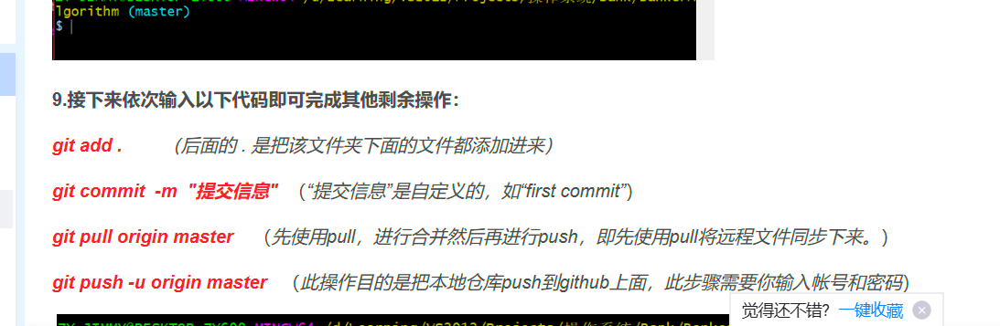

---
title: 博客更新指令
published: 2025-09-02
description: ''
image: ''
tags: []
category: Blog_Commands
draft: false 
lang: ''
---

git push -u origin master

- **创建新文章：** `pnpm new-post <文件名>`
- **编辑文章：** 修改 `src/content/posts/` 中的文件
- **自定义页面：** 编辑 `src/content/spec/` 中的特殊页面
- **添加图片：** 将图片放在 `src/assets/` 或 `public/` 中

