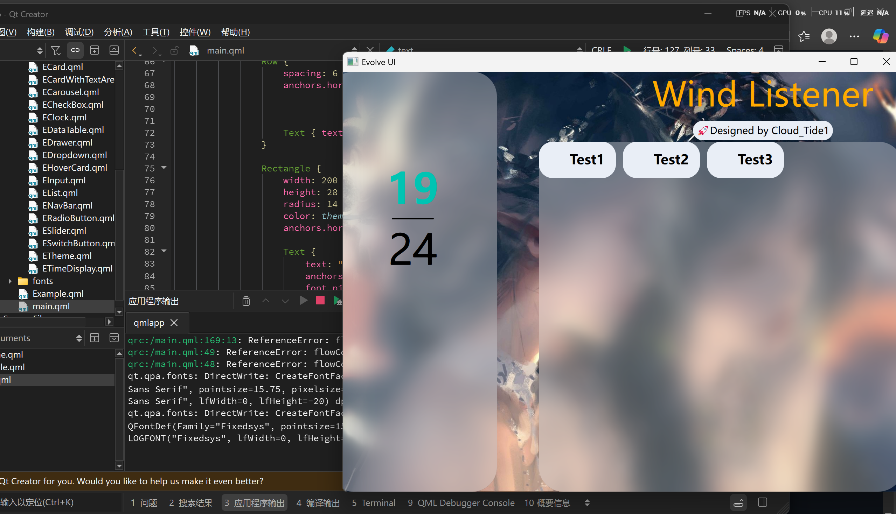
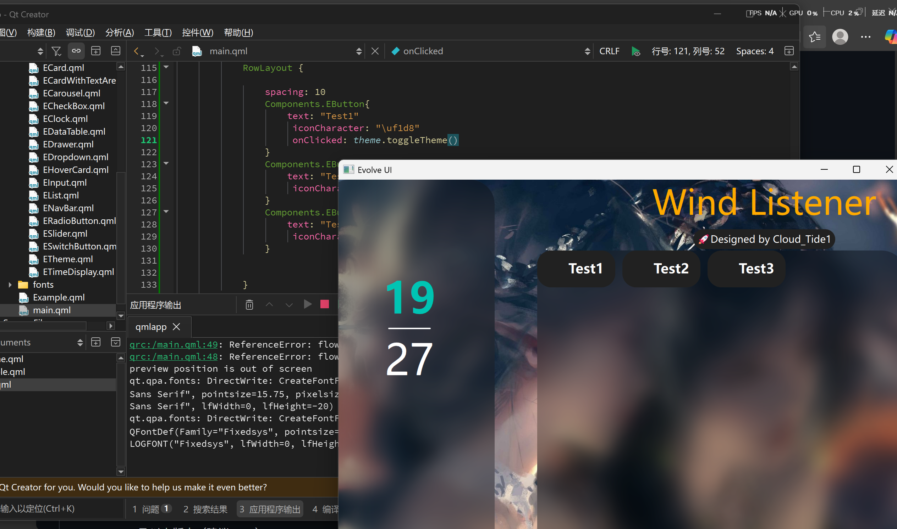

# Qt Quick项目阶段性总结：构建现代化UI的布局与组件化实践

最近我完成了一个基于Qt Quick的现代化UI界面开发，在此对阶段性成果进行总结。本项目通过QML实现了具有毛玻璃效果、动态主题切换和响应式布局的优雅界面，下面分享我的技术实践和心得。

## 1. 项目概述与技术架构

这个名为"Evolve UI"的应用采用了典型的QML应用程序结构，以`ApplicationWindow`作为根窗口，集成了自定义组件库和现代化UI设计理念。

**核心技术特点**：
- 使用Qt 6的QtQuick框架作为基础
- 采用组件化架构，将功能模块封装为可重用组件
- 实现了动态主题切换机制
- 运用了先进的毛玻璃视觉效果

## 2. 界面布局设计与实现

### 2.1 锚点布局系统
项目中大量使用了QML的锚点(anchors)布局系统，这是实现精确定位的关键技术：

```qml
// 左侧侧边栏定位示例
Components.EBlurCard {
    width: 240
    height: parent.height
    anchors.top: parent.top
    anchors.left: parent.left
    anchors.bottom: parent.bottom
    anchors.leftMargin: -20
}
```

锚点系统通过定义控件与父容器或其他控件的关系来实现布局，如`anchors.left: parent.left`表示左对齐父容器，这种声明式语法大大简化了布局代码。

### 2.2 混合布局策略
项目结合使用了多种布局方式：

- **绝对定位与相对定位结合**：主要界面区域使用锚点布局，内部元素采用RowLayout进行水平排列
- **响应式设计**：使用`parent.width`和`parent.height`等相对尺寸单位，使界面能适应不同窗口大小

### 2.3 滚动区域处理
通过`Flickable`元素创建可滚动内容区域，这是处理超长内容的有效方案：

```qml
Flickable {
    id: flickable
    anchors.fill: parent
    clip: true
    contentWidth: flowContent.implicitWidth
    contentHeight: flowContent.implicitHeight
}
```

## 3. 自定义组件开发与实践

### 3.1 组件化架构
项目采用了组件化设计理念，将功能封装为独立组件：

```qml
// 自定义组件使用示例
import "components" as Components

Components.ETheme { id: theme }
Components.EBlurCard { ... }
Components.EButton { ... }
```

这种架构提高了代码的可重用性和可维护性，符合QML的模块化设计思想。

### 3.2 主题系统实现
实现了动态主题切换功能，这是通过自定义的`ETheme`组件完成的：

```qml
Components.ETheme {
    id: theme
    backgroundImage: "qrc:/fonts/pic/01.jpg"
}
```

主题系统统一管理颜色、字体和图片资源，只需调用`theme.toggleTheme()`即可实现整体主题切换，这与Qt的QSS样式表机制有异曲同工之妙。

## 4. 视觉效果与用户体验优化

### 4.1 毛玻璃效果
项目中最显著的视觉效果是毛玻璃模糊效果，通过自定义的`EBlurCard`组件实现：

```qml
Components.EBlurCard {
    blurSource: background  // 指定模糊源
    borderRadius: 35        // 圆角设计
    // ...其他属性
}
```

这种效果增强了界面的层次感和现代感。

### 4.2 字体图标集成
使用`FontLoader`加载了FontAwesome图标字体，为按钮提供丰富的图标支持：

```qml
FontLoader {
    id: iconFont
    source: "qrc:/new/prefix1/fonts/fontawesome-free-6.7.2-desktop/otfs/Font Awesome 6 Free-Solid-900.otf"
}
```

图标字体比图片图标更具灵活性，可以轻松调整颜色和大小。

## 5. 技术亮点与创新

### 5.1 布局技术应用
本项目综合运用了多种QML布局技术：
- 使用锚点布局实现**精确定位**
- 使用`RowLayout`实现**水平排列**的按钮组
- 通过嵌套布局实现**复杂界面结构**

### 5.2 性能优化措施
- 图片缓存控制：`cache: false`防止背景图片不必要的缓存
- 裁剪区域优化：`clip: true`确保只绘制可见区域
- 分层渲染：合理使用`layer.enabled`优化视觉效果性能

## 6. 遇到的问题与解决方案

### 6.1 布局层级管理
初期遇到的主要问题是布局层级混乱，导致视觉元素重叠。通过以下措施解决：
- 明确z轴顺序，确保视觉层次正确
- 使用锚点边际（margins）创建合理的间距
- 分组管理相关元素，提高布局代码可读性

### 6.2 响应式设计挑战
为确保界面在不同尺寸下的表现一致，采用了：
- 相对尺寸单位（如`parent.width-240`）
- 弹性布局容器（如`Flickable`）
- 自适应内容区域

## 7. 经验总结与最佳实践

通过这个项目，我总结了以下QML开发经验：

1. **布局选择策略**：简单线性布局使用`Row`/`Column`，复杂布局优先考虑锚点系统
2. **组件化设计**：将通用功能封装为自定义组件，提高代码复用性
3. **资源管理**：使用Qt资源系统(qrc)管理字体、图片等静态资源
4. **关注性能**：注意视觉效果的性能开销，特别是在低端设备上

## 8. 下一步计划

基于当前成果，未来计划进一步优化：

1. 实现更多主题风格，支持用户自定义主题
2. 增加交互动画，提升用户体验
3. 优化移动端适配，增强跨平台兼容性
4. 完善组件库，增加更多可重用UI组件

这个项目展示了如何利用Qt Quick技术快速构建现代化、可视吸引力强的用户界面。QML的声明式语法和强大的布局系统使界面开发变得更加高效和灵活。通过不断实践和优化，我们将能够创建出更加精致和功能丰富的应用程序。